---
## Front matter
title: "Отчёт по лабораторной работе №3"
subtitle: "Дисциплина: Научное программирование"
author: "Дэнэилэ Александр Дмитриевич, НПМмд-02-23"

## Generic otions
lang: ru-RU
toc-title: "Содержание"

## Bibliography
bibliography: bib/cite.bib
csl: pandoc/csl/gost-r-7-0-5-2008-numeric.csl

## Pdf output format
toc: true # Table of contents
toc-depth: 2
lof: true # List of figures
lot: true # List of tables
fontsize: 12pt
linestretch: 1.5
papersize: a4
documentclass: scrreprt
## I18n polyglossia
polyglossia-lang:
  name: russian
  options:
	- spelling=modern
	- babelshorthands=true
polyglossia-otherlangs:
  name: english
## I18n babel
babel-lang: russian
babel-otherlangs: english
## Fonts
mainfont: PT Serif
romanfont: PT Serif
sansfont: PT Sans
monofont: PT Mono
mainfontoptions: Ligatures=TeX
romanfontoptions: Ligatures=TeX
sansfontoptions: Ligatures=TeX,Scale=MatchLowercase
monofontoptions: Scale=MatchLowercase,Scale=0.9
## Biblatex
biblatex: true
biblio-style: "gost-numeric"
biblatexoptions:
  - parentracker=true
  - backend=biber
  - hyperref=auto
  - language=auto
  - autolang=other*
  - citestyle=gost-numeric
## Pandoc-crossref LaTeX customization
figureTitle: "Рис."
tableTitle: "Таблица"
listingTitle: "Листинг"
lofTitle: "Список иллюстраций"
lotTitle: "Список таблиц"
lolTitle: "Листинги"
## Misc options
indent: true
header-includes:
  - \usepackage{indentfirst}
  - \usepackage{float} # keep figures where there are in the text
  - \floatplacement{figure}{H} # keep figures where there are in the text
---

# Цель работы

Ознакомиться с основами работы с GNU Octave.

# Задание

1. Изучить операции для задания векторов и матриц.
1. Изучить возможные операции над векторами и матрицами.
1. Ознакомиться с функционалом для построения графиков функций.
1. Ознакомиться с функционалом для создания файлов операций и их сравнения.

# Выполнение лабораторной работы

## Простейшие операции

Для включения журналирования используется оператор *diary on*. Консоль в Octave можно использовать как простой калькулятор для простейших вычислений.

Задание матриц и векторов происходит с помощью квадратных скобок [, ]  (рис. @fig:001)

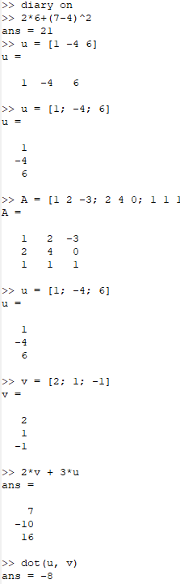{#fig:001 width=60%}

## Операции с векторами

 В Octave можно складывать вектора и умножать их на скаляр, вычислять скалярное и векторное произведение двух векторов и норму вектора (рис. @fig:002).

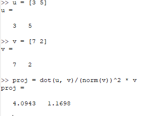{#fig:002 width=60%}

Для вычисления проекции вектора используется формула $proj_{\vec{u}} = \frac{\vec{u} \cdot \vec{v}}{\| \vec{u} \|^2} \vec{v}$ .

## Матричные операции

В Octave возможны следующие операции над матрицами (рис. @fig:003) и (рис. @fig:004) : 

1. Сложение матриц

1. Умножение матриц 

1. Умножение матриц на скаляр 

1. Транспонирование 

1. Вычисление определителя и обратной матрицы

1. Нахождение собственных значений и ранга матрицы

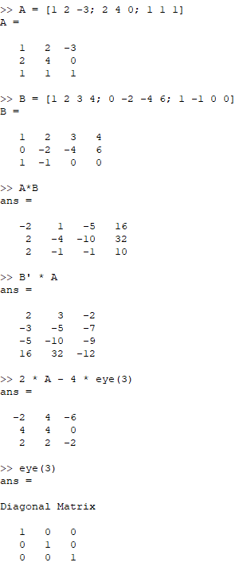{#fig:003 width=60%}

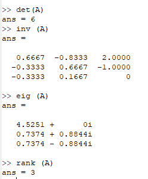{#fig:004 width=60%}

## Построение простейших графиков

1. Построен график $\sin x$ на интеравале $[0, 2\pi]$. Был улучшен график, изменен цвет и толщина линии, подписаны и масштабированы  оси, добавлена сетка, легенда и название графика. 

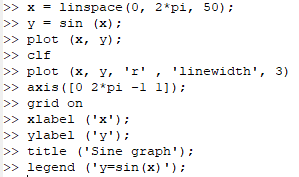{#fig:005 width=60%}

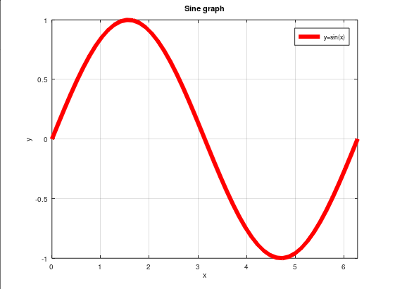{#fig:006 width=60%}

1. Построены несколько графиков на одной картинке. 

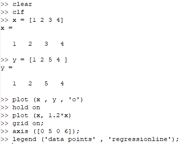{#fig:007 width=60%}

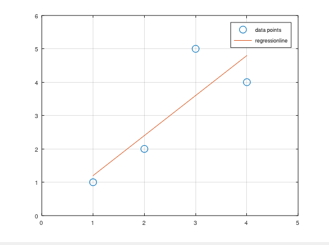{#fig:008 width=60%}

1. Построен график функции $y = x^2 \sin x$. При попытке построить график была преодолена ошибка. Было использовано поэлементное умножение.

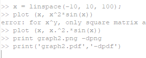{#fig:009 width=60%}

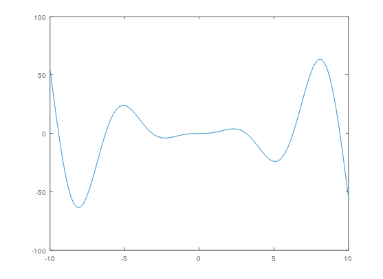{#fig:010 width=60%}

## Сравнение циклов и операций с векторами

Подсчитаем сумму $\sum\limits_1^{100000} \frac{1}{n^2}$.

Это можно сделать с помощью цикла *for* (рис. @fig:011).

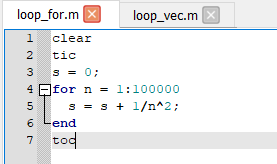{#fig:011 width=70%}

Или операции *sum* для вектором (рис. @fig:012).

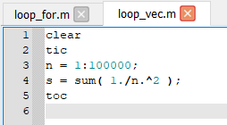{#fig:012 width=70%}

Операции с векторами намного эффективнее циклов (рис. @fig:013).

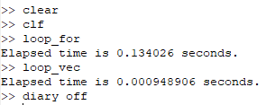{#fig:013 width=70%}

# Выводы

Изучила основы языка Octave и научился работе с векторами и графиками.

# Список литературы{.unnumbered}

::: {#refs}
:::
