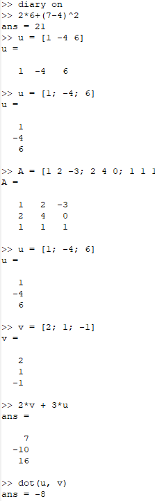
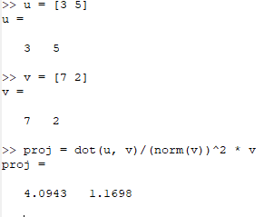
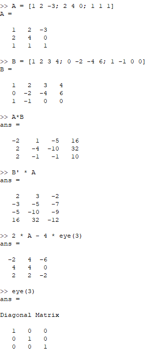
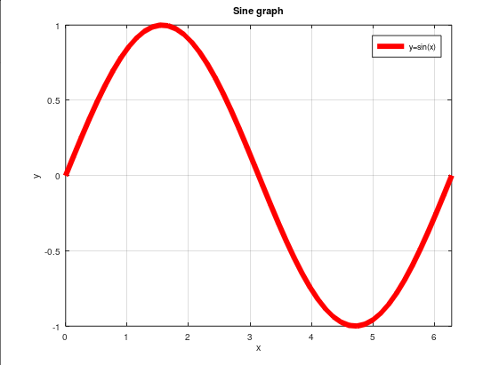
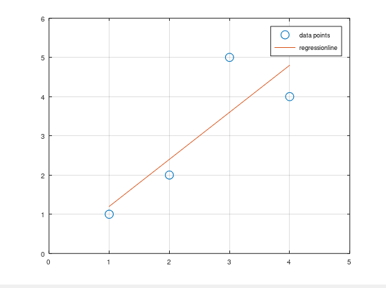
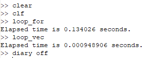

---
## Front matter
lang: ru-RU
title: Лабораторная работа №3
subtitle: Научное программирование
author:
  - Дэнэилэ Александр Дмитриевич
institute:
  - Российский университет дружбы народов, Москва, Россия
  - НПМмд-02-23
date: 14 октября 2023

## i18n babel
babel-lang: russian
babel-otherlangs: english

## Fonts
mainfont: PT Serif
romanfont: PT Serif
sansfont: PT Sans
monofont: PT Mono
mainfontoptions: Ligatures=TeX
romanfontoptions: Ligatures=TeX
sansfontoptions: Ligatures=TeX,Scale=MatchLowercase
monofontoptions: Scale=MatchLowercase,Scale=0.9

## Formatting pdf
toc: false
toc-title: Содержание
slide_level: 2
aspectratio: 169
section-titles: true
theme: metropolis
header-includes:
 - \metroset{progressbar=frametitle,sectionpage=progressbar,numbering=fraction}
 - '\makeatletter'
 - '\beamer@ignorenonframefalse'
 - '\makeatother'
---

# Введение в работу с Octave

## Цель лабораторной работы

Освоить основы работы с GNU Octave.

## Задачи лабораторной работы

1. Изучить операции для задания векторов и матриц.
1. Изучить возможные операции над векторами и матрицами.
1. Ознакомиться с функционалом для построения графиков функций.
1. Ознакомиться с функционалом для создания файлов операций и их сравнения.

# Ход лабораторной работы

## Простейшие операции

Для задания векторов и матриц используются [ и ].

## Векторные операции

В Octave можно складывать вектора и умножать их на скаляр, вычислять скалярное и векторное произведение двух векторов и норму вектора.

## Матричные операции

В Octave можно складывать и перемножать матрицы, умножать их на скаляр и транспонировать, вычислять определитель и обратную матрицу, находить собственные значения и ранг матрицы.

## Построение графиков

Графики строятся с помощью функции plot.

## Два графика на одном рисунке

Графики можно добавить на существующую фигуру с пмощью функции hold on.

## Сравнение циклов и векторных операций

Операции с векторами намного эффективнее циклов.

## Выводы

Изучил основы языка Octave и научился работе с векторами и графиками.

