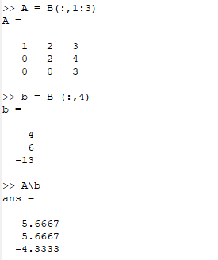
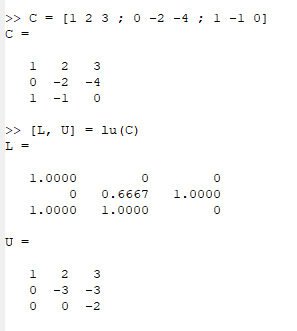
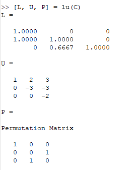

---
## Front matter
lang: ru-RU
title: Лабораторная работа №4
subtitle: Научное программирование
author:
  - Дэнэилэ Александр Дмитриевич
institute:
  - Российский университет дружбы народов, Москва, Россия
  - НПМмд-02-23
date: 28 октября 2023

## i18n babel
babel-lang: russian
babel-otherlangs: english

## Fonts
mainfont: PT Serif
romanfont: PT Serif
sansfont: PT Sans
monofont: PT Mono
mainfontoptions: Ligatures=TeX
romanfontoptions: Ligatures=TeX
sansfontoptions: Ligatures=TeX,Scale=MatchLowercase
monofontoptions: Scale=MatchLowercase,Scale=0.9

## Formatting pdf
toc: false
toc-title: Содержание
slide_level: 2
aspectratio: 169
section-titles: true
theme: metropolis
header-includes:
 - \metroset{progressbar=frametitle,sectionpage=progressbar,numbering=fraction}
 - '\makeatletter'
 - '\beamer@ignorenonframefalse'
 - '\makeatother'
---

# Системы линейных уравнений

## Цель лабораторной работы

Ознакомиться с основами работы с системами линейных уравнений в GNU Octave.

## Задачи лабораторной работы

1. Ознакомиться с реализацией метода Гаусса.
1. Изучить метод левого деления.
1. Ознакомиться с LU-разложением и LUP-разложением.

# Ход лабораторной работы

## Расширенная матрица и метод Гаусса

Ознакомился с методами обращения как к отдельному элементу, так и к целой строке/столбцу матрицы. Реализовал метод Гаусса. 

## Метод левого деления

Реализуем метод левого деления, разбив расширенную матрицу *B* на квадратную матрицу *A* и вектор-столбец *b*.

## LU-разложение

Реализуем LU-разложение матрицы *С*.

## LUP-разложение

Реализуем LUP-разложение матрицы *С*.

## Выводы

Научился работе с системами линейных алгебраических уравнений в Octave.

