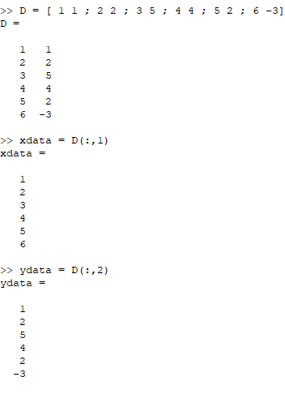
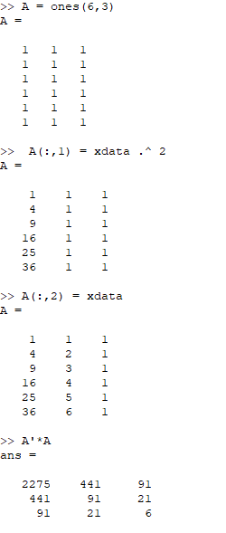
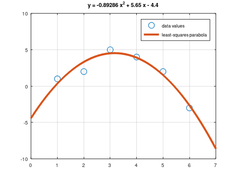
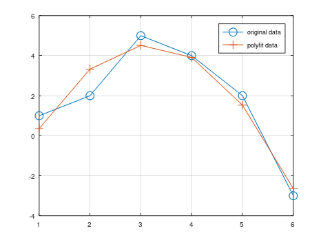
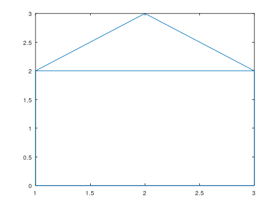
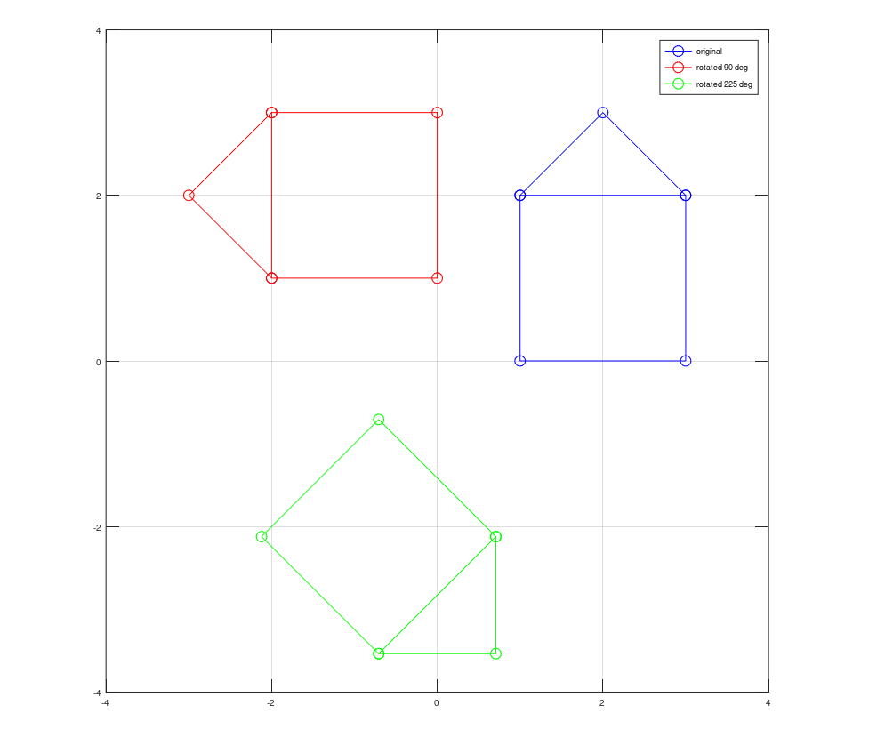
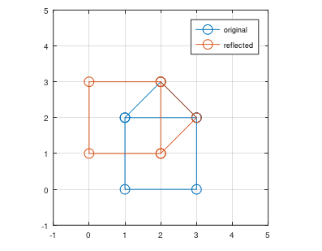
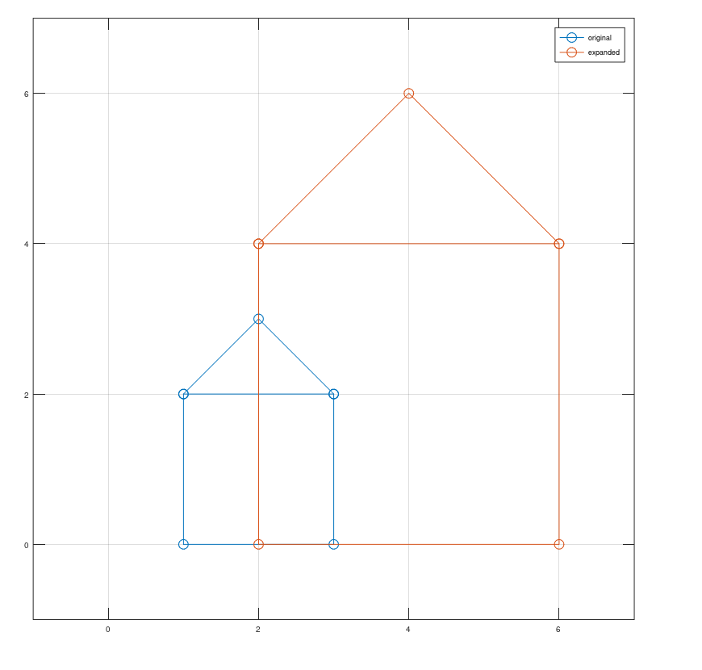

---
## Front matter
title: "Отчёт по лабораторной работе №5"
subtitle: "Дисциплина: Научное программирование"
author: "Дэнэилэ Александр Дмитриевич, НПМмд-02-23"

## Generic otions
lang: ru-RU
toc-title: "Содержание"

## Bibliography
bibliography: bib/cite.bib
csl: pandoc/csl/gost-r-7-0-5-2008-numeric.csl

## Pdf output format
toc: true # Table of contents
toc-depth: 2
lof: true # List of figures
lot: true # List of tables
fontsize: 12pt
linestretch: 1.5
papersize: a4
documentclass: scrreprt
## I18n polyglossia
polyglossia-lang:
  name: russian
  options:
	- spelling=modern
	- babelshorthands=true
polyglossia-otherlangs:
  name: english
## I18n babel
babel-lang: russian
babel-otherlangs: english
## Fonts
mainfont: PT Serif
romanfont: PT Serif
sansfont: PT Sans
monofont: PT Mono
mainfontoptions: Ligatures=TeX
romanfontoptions: Ligatures=TeX
sansfontoptions: Ligatures=TeX,Scale=MatchLowercase
monofontoptions: Scale=MatchLowercase,Scale=0.9
## Biblatex
biblatex: true
biblio-style: "gost-numeric"
biblatexoptions:
  - parentracker=true
  - backend=biber
  - hyperref=auto
  - language=auto
  - autolang=other*
  - citestyle=gost-numeric
## Pandoc-crossref LaTeX customization
figureTitle: "Рис."
tableTitle: "Таблица"
listingTitle: "Листинг"
lofTitle: "Список иллюстраций"
lotTitle: "Список таблиц"
lolTitle: "Листинги"
## Misc options
indent: true
header-includes:
  - \usepackage{indentfirst}
  - \usepackage{float} # keep figures where there are in the text
  - \floatplacement{figure}{H} # keep figures where there are in the text
---

# Цель работы

Ознакомиться с основами работы с системами линейных уравнений в GNU Octave.

# Задание

1. Ознакомиться с реализацией метода Гаусса.
1. Изучить метод левого деления.
1. Ознакомиться с LU-разложением и LUP-разложением.

# Выполнение лабораторной работы

## Подгонка полиномиальной прямой

1. Создадим матрицу данных и отдельные вектора *x* и *y* (рис. @fig:001), которые в графическом представлении имеют вид (рис. @fig:002).

{#fig:001 width=60%}

2. Мы хотим подогнать наши данные под кривую $y = a_1 x^2 + a_2 x + a_3$. Для этого создадим матрицу *A* (рис. @fig:002).

{#fig:002 width=70%}

4. Для построения полиномиальной кривой создадим векторы *x* и *y* (рис. @fig:005) и построим график (рис. @fig:003).

{#fig:003 width=70%}

5. Для построения полиномальной кривой можно использовать встроенный метод *polyfit* (рис. @fig:004), В результате получаем такой график

{#fig:004 width=70%}

## Матричные преобразования

Создадим матрицу данных и отдельные вектора *x* и *y* (рис. @fig:009), которые в графическом представлении имеют вид (рис. @fig:05).

{#fig:05 width=70%}

### Вращение

Изучим, как осуществляется вращение изображения.

Зададим угол поворота и матрицу вращения, посчитаем новые координаты для угла 90 градусов и угла 225 градусов. В результате получаем такую картинку (рис. @fig:006).

{#fig:006 width=60%}

### Отражение

Изучим, как осуществляется отражение изображения относительно прямой.

Зададим матрицу отражения относительно прямой $x = y$, посчитаем новые координаты. В результате получаем такую картинку 
(рис. @fig:007).

{#fig:007 width=70%}

### Дилатация

Изучим, как осуществляется дилатация (расширение или сжатие) изображения.

Зададим матрицу расширения в 2 раза, посчитаем новые координаты. В результате получаем такую картинку (рис. @fig:008)).

{#fig:008 width=70%}

# Выводы

Изучил подгонку полиномиальной прямой и матричные преобразования в Octave.

# Список литературы{.unnumbered}

::: {#refs}
:::
